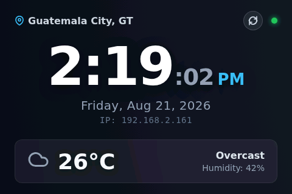
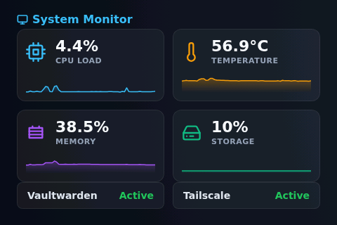

# DietPi-Dashboard

A lightweight, 480x320 optimized web dashboard designed for a Raspberry Pi kiosk display (such as a DietPi setup). 

## Features
- **Real-time Clock & Date**: Clean and prominent display with automatic network status indicators.
- **Weather Integration**: Live weather updates using the Open-Meteo API.
- **System Monitoring**: View CPU load, Temperature, Memory usage, and Storage via sparkline graphs.
- **Swipe Navigation**: Touch-enabled carousel to switch between the clock and dashboard pages.
- **Service Status**: Quick overview of running services like Vaultwarden and Tailscale.

## Setup
- Serve the directory using a lightweight web server, such as `python -m http.server 8080`.
- The dashboard periodically fetches a `data.json` file for system metrics. 
- Use the included Python scripts to periodically generate `data.json` with the system's live metrics.

